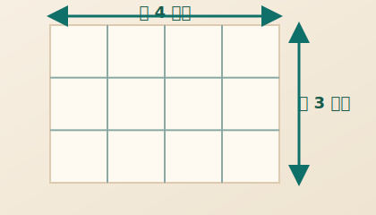

## 問題

この問題は、`CCC` の Markdown レンダラの表示確認用に用意したサンプルです。  
表、画像、箇条書き、番号付きリスト、コードブロックなどがどのように表示されるかを確認できます。

## 制約

この問題に制約はありません。

## 対応している主な記法

### 箇条書き

- 項目 A
- 項目 B
  - 1 段深い項目
  - `****` のような記号をインラインコードで書く例

### 番号付きリスト

1. 手順 1
2. 手順 2
3. 手順 3

### 引用

> これは引用の表示例です。
> 2 行続けて書いたときの見え方も確認できます。

### 水平線

---

### 斜体と打ち消し線

- `*italic*` は *italic* のように表示されます
- `~~text~~` は ~~text~~ のように表示されます

### 表

| 記法 | 例 | 備考 |
| --- | --- | --- |
| 太字 | `**strong**` | **太字** として表示されます |
| インラインコード | `` `puts("OK");` `` | `puts("OK");` のように表示されます |
| 記号を含むコード | `` `|` `` や `` `****` `` | パースが崩れないかの確認用です |

### 画像

下の図は、横 4 マス・縦 3 マスの格子を表しています。



### コードブロックとシンタックスハイライト

```c
#include <stdio.h>

int main()
{
	// This is C.
	int a = 12;
	int b = 34;
	printf("This is C: %d\n", (a + b));
}
```

```cpp
#include <print>
#include <string>

int main()
{
	// This is C++.
	std::string name = "C++";
	std::println("This is {}.", name);
}
```

```python
# This is Python.
name = "Python"
count = 3

for _ in range(count):
    print(f"This is {name}.")
```

## 現時点で未対応または弱い記法

- タスクリスト: `- [ ] item`
- 脚注

## 入力

この問題に入力はありません。

## 出力

文字列 `OK` を 1 行で出力してください。

## ヒント

表示確認用の問題なので、まずは固定文字列を 1 行出力できれば十分です。
